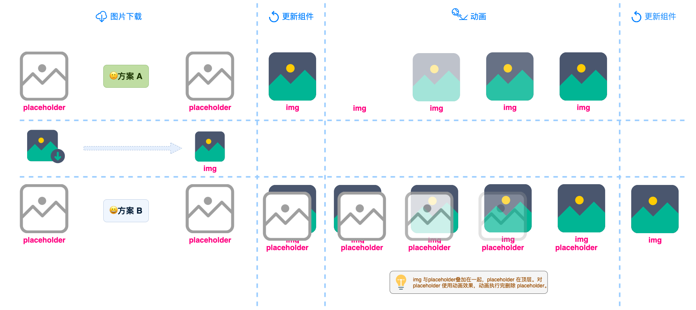
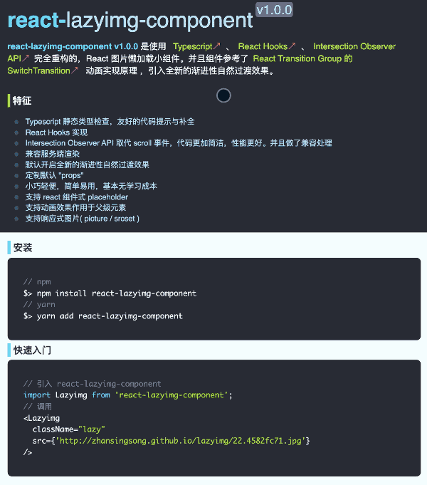
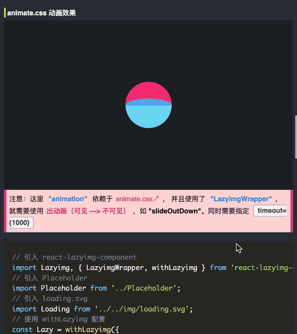

# react-lazyimg-component

**react-lazyimg-component v1.0.0** 是使用 [Typescript](https://www.typescriptlang.org/)、[React Hooks](https://zh-hans.reactjs.org/docs/hooks-reference.html)、[Intersection Observer API](https://developer.mozilla.org/zh-CN/docs/Web/API/Intersection_Observer_API)完全重构的，React 图片懒加载小组件。并且组件参考了[React Transition Group 的 SwitchTransition](https://reactcommunity.org//switch-transition) 动画实现原理 ，引入全新的渐进性自然过渡效果（如下图 **方案 B** 所示）。



**Demo 效果**



> singsong: Demo 中第一张图片未使用 **渐进性自然过渡效果**，会存在跳闪现象。第二张图片使用 **渐进性自然过渡效果**。效果更加自然！😀



### PC 预览：

[:point_right: 猛击这里吧 :soon:](http://zhansingsong.github.io/lazyimg/)

### 手机预览(扫一扫)：


## 特性 🌲

- Typescript 静态类型检查，友好的代码提示与补全
- React Hooks 实现
- Intersection Observer API 取代 scroll 事件，代码更加简洁，性能更好。并且做了兼容处理
- 兼容服务端渲染
- 定制默认 `props`
- 默认开启全新的渐进性自然过渡效果
- 小巧轻便，简单易用，基本无学习成本
- 支持 react 组件式 placeholder
- 支持动画效果作用于父级元素
- 支持响应式图片( picture / srcset )

## 安装

```bash
// npm
$> npm install react-lazyimg-component
// yarn
$> yarn add react-lazyimg-component
```

## 快速入门 🌴

```js
// 引入 react-lazyimg-component
import Lazyimg from 'react-lazyimg-component';
// 调用
<Lazyimg className="lazy" src={'http://zhansingsong.github.io/lazyimg/22.4582fc71.jpg'} />;
```

## 一些常用实例 🎯

### 使用 "LazyimgWrapper" 开启渐进性过渡效果

```js
// 引入 react-lazyimg-component
import Lazyimg, {LazyimgWrapper} from 'react-lazyimg-component';
<LazyimgWrapper>
  <Lazyimg className="lazy" src={'http://zhansingsong.github.io/lazyimg/bg9.b4fca14f.jpg'} />
</LazyimgWrapper>;
```

### placeholder 组件

```js
// 定义 placeholder 组件
import React from 'react';
import './style.scss';
export default (props) => {
  let {className, text, img, children} = props;
  return (
    <div
      className={['placeholder', className]
        .filter((item) => {
          if (item) {
            return item;
          }
        })
        .join(' ')}
    >
      {img && }
      {text && <span className="placeholder-text">{children || text}</span>}
    </div>
  );
};

// 引入 react-lazyimg-component
import Lazyimg from 'react-lazyimg-component';
// 引入 Placeholder
import Placeholder from './Placeholder';
// 引入 fire.svg
import Fire from './img/fire.svg';

<Lazyimg
  placeholder={<Placeholder img={Fire} />}
  animateType="animation"
  animateClassName={['animated', 'rollIn']}
  className="lazy"
  timeout={1000}
  src={'http://zhansingsong.github.io/lazyimg/bg9.b4fca14f.jpg'}
/>;
```

### 使用 "withLazying" 配置 react 组件式 placeholder

```js
// 引入 react-lazyimg-component
import Lazyimg, {LazyimgWrapper, withLazyimg} from 'react-lazyimg-component';
// 引入 Placeholder
import Placeholder from './Placeholder';
// 引入 loading.svg
import Loading from './img/loading.svg';
// 使用 withLazyimg 配置
const Lazy = withLazyimg({
  placeholder: <Placeholder img={Loading} />,
  threshold: 0.98,
});
<LazyimgWrapper style={{height: '100%', width: '100%'}}>
  <Lazy className="lazy" src={'http://zhansingsong.github.io/lazyimg/bg9.b4fca14f.jpg'} />
</LazyimgWrapper>;
```

### transition 动画效果

- 动画样式

  ```css
  .transition-enter {
    opacity: 0;
    transform: scale(1.04);
  }

  .transition-enter-active {
    opacity: 1;
    transform: scale(1);
    transition: opacity 400ms, transform 400ms;
  }
  ```

- 组件

  ```js
  // 引入 react-lazyimg-component
  import Lazyimg from 'react-lazyimg-component';

  <Lazyimg
    animateType="transition"
    animateClassName={['transition-enter', 'transition-enter-active']}
    className="lazy"
    timeout={400}
    src={'http://zhansingsong.github.io/lazyimg/bg9.b4fca14f.jpg'}
  />;
  ```

> singsong: 这里 `"transition"` 使用的是 **进动画（不可见 ---> 可见）**。如果使用 `"LazyimgWrapper"`，就需要使用 **出动画（可见 ---> 不可见）**。同时不要忘记指定 `timeout={1000}` 😬

### animate.css 动画效果

使用 [`animate.css`](https://github.com/daneden/animate.css) 样式动画库实现过渡效果。

```js
// 引入 react-lazyimg-component
import Lazyimg, {LazyimgWrapper, withLazyimg} from 'react-lazyimg-component';
// 引入 Placeholder
import Placeholder from '../Placeholder';
// 引入 loading.svg
import Loading from '../../img/loading.svg';
// 使用 withLazyimg 配置
const Lazy = withLazyimg({
  placeholder: <Placeholder img={Loading} />,
  threshold: 0.98,
});
<LazyimgWrapper style={{height: '100%', width: '100%'}}>
  <Lazy
    animateType="animation"
    animateClassName={['animated', 'slideOutDown']}
    timeout={1000}
    className="lazy"
    src={'http://zhansingsong.github.io/lazyimg/bg9.b4fca14f.jpg'}
  />
</LazyimgWrapper>;
```

> singsong：这里 `"animation"` 依赖于 [`animate.css`](https://github.com/daneden/animate.css)， 并且使用了 `"LazyimgWrapper"`，就需要使用 **出动画（可见 ---> 不可见）**，如 "slideOutDown"。同时需要指定 `timeout={1000}`

### 基于 `loaded` 钩子函数自定义动画效果

```js
// 引入 react-lazyimg-component
import Lazyimg from 'react-lazyimg-component';
// 调用
<Lazyimg
  className="lazy"
  src={'http://zhansingsong.github.io/lazyimg/22.4582fc71.jpg'}
  loaded={(el) => {
    // 自定义动画效果
    window.Velocity(el, 'transition.whirlIn', {
      // 需要引入 Velocity 动画库
      duration: 600,
    });
    // 避免执行默认动画逻辑
    return true;
  }}
/>;
```

### 父级动画效果

```js
// 指定动画效果作用于该父级元素
<div className="example-wp">
  <Title title="父级动画效果" className="sub" />
  <div className="example-img">
    <Lazyimg
      className="lazy"
      src={'http://zhansingsong.github.io/lazyimg/22.4582fc71.jpg'}
      animateType="animation"
      animateClassName={['animated', 'flipInY']}
      timeout={1000}
      parent=".example-wp" // 指定父级元素选择器，也可以指定父级层级level：2
    />
  </div>
</div>
```

> singsong：当图片元素加载完，动画效果会作用在指定的父级元素上。

### 响应式图片( picture / srcset )

```js
  // dpr
  <Lazyimg
    className="lazy"
    src={'http://zhansingsong.github.io/lazyimg/22.4582fc71.jpg'}
    srcSet="source_1x.png 1x, source_2x.png 2x, source_3x.png 3x, source_3.5x.png 3.5x"
    timeout={1000}
    animateType="animation"
    animateClassName={['animated', 'bounceIn']}
  />

  // media-query、srcSet、sizes
  <Lazyimg
    className="lazy"
    src={'http://zhansingsong.github.io/lazyimg/22.4582fc71.jpg'}
    srcSet="source_360.png 360w, source_640.png 640w, source_980.png 980w, source_1290.png 1290w"
    sizes="(min-width: 370px) 100vw, (min-width: 640px) 75vw,(max-width: 980px) 50vw, 360"
    timeout={1000}
    animateType="animation"
    animateClassName={['animated', 'bounceIn']}
  />

  // picture
  <picture>
    <source media="(min-width: 650px)" srcSet="https://www.w3schools.com/tags/img_pink_flowers.jpg" />
    <source media="(min-width: 465px)" srcSet="https://www.w3schools.com/tags/img_white_flower.jpg"/>
    <Lazyimg
      className="lazy"
      src={'http://zhansingsong.github.io/lazyimg/22.4582fc71.jpg'}
      timeout={1000}
      animateType="animation"
      animateClassName={['animated', 'zoomIn']}
    />
  </picture>
```

## API

通过 `props` 来决定懒加载的行为，to use is super easy😎。

- **Lazyimg：默认组件**

  ```js
  // 图片地址
  src: string;
  // 响应式【可选】
  srcSet: string;
  // 指定元素的 node Type，默认为 `img`【可选】
  element?: string;
  // 为 `true` 时，直接替换 src，不使用懒加载行为。默认为 'false'【可选】
  force?: boolean;
  // 在图片加载好替换前 hook 回调 【可选】
  loaded?: (el?: HTMLElement) => void;
  // 动画执行完完 hook 回调【可选】
  end?: (el?: HTMLElement) => void;
  // 过渡动画类型【可选】
  animateType?: 'none' | 'transition' | 'animation';
  // 动画作用类名【可选】
  animateClassName?: string[];
  // 动画执行时长，用于动画事件的不兼容时回退处理【可选】
  timeout?: number;
  // 动画作用于父级元素【可选】
  parent?: number | string;
  // 指定图片加载前，显示内容【可选】
  placeholder?: React.ReactNode;
  // Intersection observer options：https://developer.mozilla.org/zh-CN/docs/Web/API/Intersection_Observer_API 【可选】
  root?: Element;
  rootMargin?: string;
  threshold?: number[];
  ```

  - src：图片地址
  - srcSet：响应式图片地址
  - force：为 `true` 时，直接替换 src，不使用懒加载行为。默认为 `false`。
  - loaded：在图片加载好替换前 hook 回调。回调参数为当前元素 `el`。
  - end：动画执行完完 hook 回调。回调参数为当前元素 `el`。
  - animateType：动画类型。可取值：

    - `'animation'`：使用 `animation` 动画
    - `'transition'`：使用 `transition` 动画
    - `'none'`：不使用动画

  - animateClassName：动画作用类名
    - 使用 `'animation'` 时，推荐使用 [`animate.css`](https://animate.style/)。取值方式为：`['animate__animated', 'animate__bounce']` 或 `['animated', 'bounce']`。
      > singsong: 如果自己实现，请遵照 `animate.css` 实现使用方式来。
    - 使用 `'transition'` 时，请按照如下的实现方式：
      ```css
      .fade-enter {
        opacity: 0;
      }
      .fade-enter-active {
        opacity: 1;
        transition: opacity 500ms;
      }
      ```
      取值方式为：`['fade-enter', 'fade-enter-active']`
  - timeout：动画执行时长，用于动画事件的不兼容时回退处理。如 `transition: opacity 500ms;`，timeout 就为 `500`。
  - parent：用于指定动画效果作用于元素的哪个父级元素。可取值：

    - 父元素的 selector 选择器（字符串）
    - 父级层级 level（整数）

  - element：指定 react 将生成的元素类型，默认为'img'。
  - placeholder：占位元素，除了支持普通的图片外，还支持 react 组件。

- **withLazyimg：定制 `Lazyimg` 组件的默认 `props`**。如使用 `withLazying` 配置 react 组件式 placeholder

  ```js
  // 引入 react-lazyimg-component
  import Lazyimg, {LazyimgWrapper, withLazyimg} from 'react-lazyimg-component';
  // 引入 Placeholder
  import Placeholder from './Placeholder';
  // 引入 loading.svg
  import Loading from './img/loading.svg';
  // 使用 withLazyimg 配置
  const Lazy = withLazyimg({
    placeholder: <Placeholder img={Loading} />,
    threshold: 0.98,
  });
  <LazyimgWrapper style={{height: '100%', width: '100%'}}>
    <Lazy className="lazy" src={'http://zhansingsong.github.io/lazyimg/bg9.b4fca14f.jpg'} />
  </LazyimgWrapper>;
  ```

- **LazyimgWrapper：包裹组件，用于包裹 `Lazyimg` 组件，方便构建渐进性自然过渡效果。**
