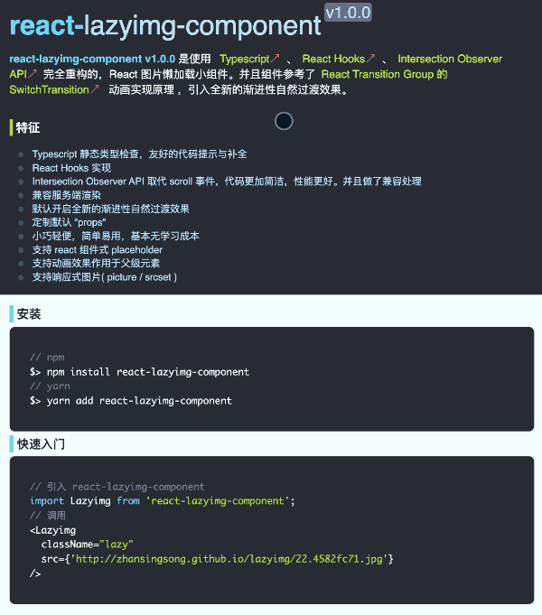

# 这种 React 渐进过渡效果可行

新项目中，使用 [Typescript](https://www.typescriptlang.org/) + [React(Hooks)](https://zh-hans.reactjs.org/docs/hooks-reference.html) 进行开发。项目需要使用图片懒加载功能，就对之前封装的 [react-lazyimg-component](https://github.com/zhansingsong/react-lazyimg-component/tree/v0.0.2) 组件进行重构。再保持原有功能基础上，做了一些优化，和改进。

- Typescript 静态类型检查，代码提示与补全更加完善
- React Hooks 实现
- Intersection Observer API 取代 scroll 事件，代码更加简洁，性能更好。并且做了兼容处理。
- 兼容服务端渲染 **SSR**
- 定制组件的默认 `props`
- 支持 react 组件式 **placeholder**
- 支持动画效果作用于父级元素
- 支持响应式图片( picture / srcset )
- 默认开启全新的渐进性自然过渡效果

🚀[在线 Demo 效果，先睹为快 >>>>>>>>>>](http://zhansingsong.github.io/lazyimg-v1/)⛵️

其中 **“默认开启全新的渐进性自然过渡效果”** 功能中的 **渐进性自然过渡效果** 如下图 **“方案 B”** 所示：

**方案 A**： 之前版本默认使用的过渡动画效果，该方案存在一个问题，在图片下载完更新组件后。图片显示后再使用进入动画效果，在某些动画效果下会存在跳闪现象（如 fade 效果）。因为过渡过程：

img(可见) -------> img(不可见) -------> img(可见)

方案 B 
为了避免跳闪现象，该方案采用了叠加遮挡方式控制 img 的可见性。在 img 下载完，更新组件时，会同时更新 placeholder 与 img，并且 placeholder 叠加在 img 之上。在对 placeholder 使用淡出动画效果。当动画执行完后，删除 placeholder。

> singsong: 方案参考 React Transition Group 的 SwitchTransition 动画实现原理。

重构后的组件不仅支持方案 A，也支持方案 B。因为 方案 B 并不是完全优于 方案 A。只适合与否。

对比效果图

> singsong: Demo 中第一张图片未使用 渐进性自然过渡效果，会存在跳闪现象。第二张图片使用 渐进性自然过渡效果。效果更加自然！😀

### 使用实现

